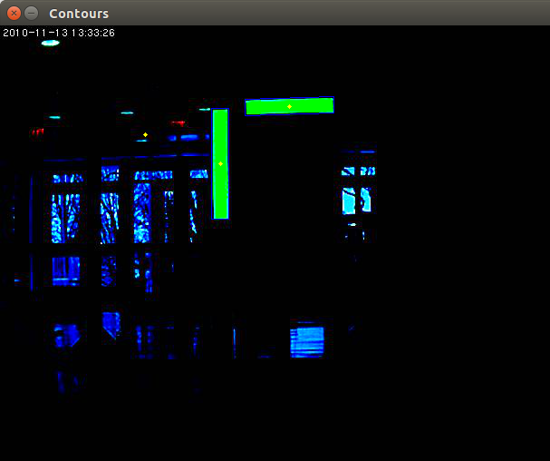
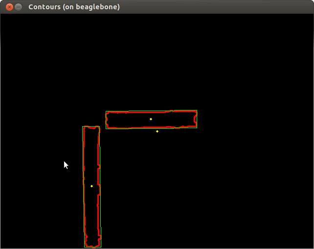
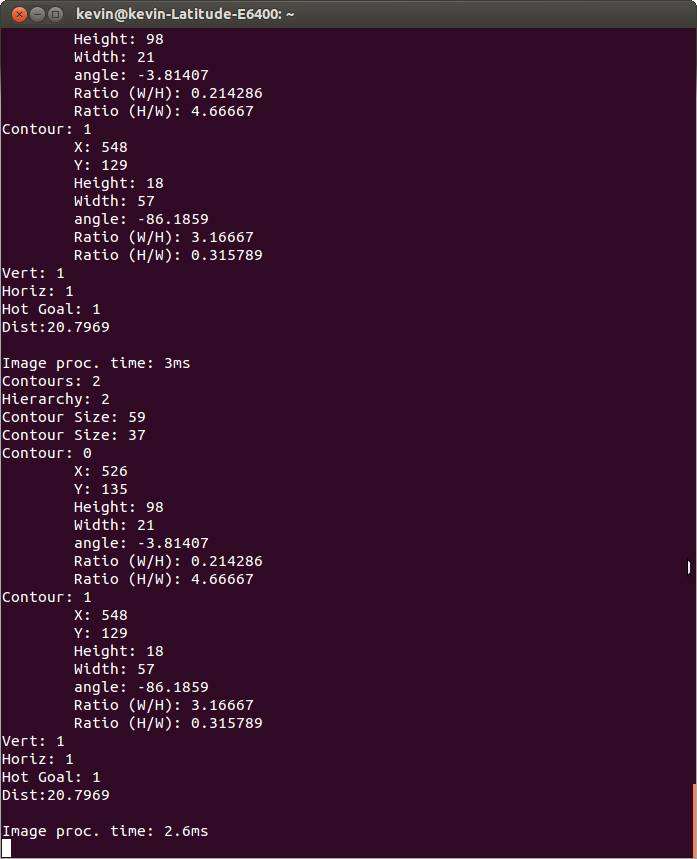

2168_Vision_Example
===================

Attached is a compiled version of the OpenCV 2.4.10 libraries, which we patched to support the particular camera functions of the USB Microsoft HD 3000 web cam.

The patch exposes certain controls to modify the USB camera image settings. The patch also expands the videoCapture contstructor to accept framesize and fps so the user can specify those parameters and have the camera set accordingly on instantiation. All settings are done at the driver hardware level using V4L2 api.

This patch is only required if using the Microsoft HD 3000 USB camera, and while it may support other USB cameras, we can not guarantee that it does. This patch is not needed if you are using an IP camera or other external capture device.

The patch is already compiled into the attached libraries, but if you would like to see what we modified, our changes to OpenCV are public here: https://github.com/KHEngineering/OpenCV_For_FRC_RoboRio/commit/aebc1d9261da2a44bdbcbac93398d48b211dafba

I have also included an example vision application written in C++ which uses OpenCV to perform last years vision task of detecting a hot goal. The example itself is very simple using only basic filters in OpenCV, (but it is exactly what we used throughout the 2014 competition season). 

This example can be ran directly on the RoboRio or a number of other Armv7 based processors such as the beaglebone family. The example supports processing images from a USB Camera, IP Axis Camera, or from a file. I have modified the program to select command line arguments which will allow it to capture images from a IP axis camera, webcam, or a file. 

## Program Outut

This is an example image taken from the camera as input to the algorithm:

This is an example image produced by the algorithm identifying the countors or interest:

This is an example image produced by the algorithm idenfiying the contors within an image:

This is an example image showing what the console will produce when verbose debugging is enabled:

-----------------------

## How to Execture Program

The source and executable are included. To run the program all you need to do is install OpenCV as per the instructions below, and then transfer the executable over and run it. Some examples on how to run it are

`./2168_Vision_Example -c 10.21.68.90 -v -t ` // this will run and capture frames from a axis camera at IP address 10.21.68.90, it will also display the processed image (because of the visualize flag -v, and will output the time it takes to process each frame because of the timing flag -t)

`./2168_Vision_Example -u  -v -t ` // this will run can capture frames from the usb camera at /dev/video0

`.2168_Vision_Example -f /home/image.jpg `//will process a static image without any output, add flags if you wish

you can use the -help flag to see all other flags supported. 

This program is multi-threaded, the frame capture runs in one thread, while the image processing runs in another. Shared memory is used between the two and read/write access is controlled via mutex lock.

The OpenCV libraraies, include files, and other required libraries are included in the project itself, so all you need to do it makesure you have the cross-compiler set up, and it should compile without a hitch.

Please let me know if there are any questions. I am releasing this under GNU, but will help troubleshoot any issues as best we can.

We have tested this to be working with the latest FRC 2015 Eclipse C++ plugins as of 1/2/2015, and the latest RoboRio Image v23, on Windows 7 32-bit with Eclipse Luna.

We have also tested this be be sucessuly at running on a beagle-bone black running latest angstrom as of 1/2/2015.

-----------------------

## How to compile the Example from Source

Assumptions: I already assume you have followed the screen steps guide on how to set, up and install your Windows Development computer for C++ FRC development. Make sure you can sucessfully build and deploy a test iterative project.

Official Directions can be found here: [Screensteps Live](https://wpilib.screenstepslive.com/s/4485/m/13810/l/145002-installing-eclipse-c-java)

Additional Troubleshooting tips can be found here: [2168 Control System Website](http://controls.team2168.org)

The easiest way to compile the example on your own from source is to clone this git repo into your eclipse. The project is already set up with all the paths so it should build without a problem.

1. Use the git import tool in eclipse, File->Import->Git->Projects From Git
2. Past the URL of this repo in, https://github.com/Team2168/2168_Vision_Example
3. Select git, or http as the protocol
4. Complete the rest of the wizard and import the project into the workspace
5. Now you have this project in your eclipse workspace
6. Open src/main.cpp, this is the main file
7. OpenCV Includes header files are included in the _Includes Directory
8. OpenCV Libraries compiled for Armv7 are included in the _Libraries Directory
9. Sample Images are included in the Images Directory as well.
10. Right Click on the Project Name, Select Build Configurations, and select Build All
11. If the Build was successfull a new Directory will be created called Rio_Beagle, and inside of it will be the 2168_Vision_Example Binary (You may need to refresh your project explorer window so the new folder shows up by right clicking on the project and selecting refresh)
12. You have successfully compiled the program, you can now modify it can recompile it with your changes
13. If you are unsucessfully at recompiling please let us know via email or post something on chiefdelphi. The offical thread for this release on chiefdelphi is http://www.chiefdelphi.com/forums/showthread.php?threadid=131905
 

## How to run the Vision Binary on the RoboRio

### Installing OpenCV on the RoboRio
1. transfer to the lib_OpenCV folder inside of _Libraries/softfp/ to the Roborio's /usr/local/lib directory (such that you have /usr/local/lib/lib_OpenCV/ on the RoboRio) If using windows you can use WinSCP, if using linux or putty use rsync instead of cp command because the files contain symlinks. You will have to install rsync on the Rio first using opkg update, opkg install rsync, while connected to the internet.
2. Now use putty or any terminal to ssh into the Roborio. If you are unsure how to do this, check out the steps on the 2168 Controls Website under the RoboRio page.
3. In the RoboRio terminal type `vi /etc/ld.so.conf.d/opencv.conf`, a new file will open inside the terminal window
4. Hit the `i` key to enter insert mode
5. Paste or type this as the only line in the file `/usr/local/lib/lib_OpenCV`
6. Hit `esc` to exit insert mode
7. Type `:wq` and then hit enter to save and exit the file
8. You should now be back at the terminal prompt
9. Run `ldconfig` in the rio terminal
10. you may get some lines that say xxx file is not a symlink, thats ok
11. done

### Transfer and Run the Example on the RoboRio

1. Use the same method as before to transfer the 2168_Vision_Example file from the Rio_Beagle/ directory to the RoboRio. You can place it wherever youd like, but a good place would be to create a new folder called Vision inside the home directory and place the binary there.
2. After transfering the binary, connect to the RoboRio via shh and navigate to the directory you placed the binary in using the `cd` command e.x. `cd /home/Vision/`
3. add execute permissions to the file `chmod +x 2168_Vision_Example
4. use `./2168_Vision_Example -help` to run the program
5. If you see a help list, you have sucessfully installed the OpenCV library and can run the program, proceed to the next section to learn about the different features of the program.
6. If you get a message like "Can not find xxx.so" Make sure you completed the installation of OpenCV above.

### Transfer and Run the Example on a BeagleBone (white/black)

If you will to run this on a beaglebone instead of the RoboRio, the steps are exactly the same as above for the Rio, just instead of the RoboRio, use the BeagleBone.

### Command Line Arguments

As stated above, you can use command line arguments to change the behavior of the program without having to recompile the code. The most general uses are

./2168_Vision -c 10.21.68.90 -v -t  // this will run and capture frames from a axis camera at IP address 10.21.68.90, it
 will also display the processed image (because of the visualize flag -v, and will output the time it takes to process 
each frame because of the timing flag -t)

./2168_Vision -u  -v -t  // this will run can capture frames from the usb camera at /dev/video0

.2168_Vision -f /home/image.jpg //will process a static image

you can use the -help flag to see all other flags supported. 

> Note: When using the -v flag, you must have X11 forwarding set up on the RoboRio and X11 client installed on your development computer. To learn how to set up X11 forwarding on the RoboRio, visit the [2168 Controls Webpage](http://controls.team2168.org) and view the RoboRio tab, to view the steps for enabling X11 forwarding on the RoboRio`

### To use the libraries in an existing C++ project
1. Copy the _Includes and _Libraries from this repo to your development computer
2. Add the path to the _Includes/OpenCV/2.4.10 to your C++ includes path
3. Add the path to the _Libraries/softfp/lib_OpenCV to your lib path
4. If you are using a pre-built toolchain you may also need to add -rpaths to the above locations under the misc settings of the linker.
4. Add which ever libraries you use to your linker (ex: opencv_highgui opencv_core opencv_imgproc pthread)
5. Those libraries will probably suit 95% of people.
6. add #include <opencv2/opencv.hpp> and using namespace cv;
7. Done

> The project here has the includes and arm libraries required as local directories, so if you use this eclipse project, and have the FRC cross compiler installed, it should find all required files automatically. The build path is already set to search the corresponding directories within the project

### To use in Java
1. Create a new Java Project
2. Copy the _Libraries folder to your development machine
3. add  _Libraries/softFP/lib_OpenCV/java/opencv-2410.jar to your java project build path
4. import org.opencv.core.Core; and any other libraries (look up opencv Java documentation for help)
5. Should be good to go!
6. NOTE: I NEVER TESTED JAVA, SO PLEASE REPORT its use

Please let me know if there are any questions

We develop most of our FRC stuff on Ubuntu 14.04, and use our own cross compiler. With that said we will try to help troubleshoot any problems you encouter as best we can.

The above have been tested on sucessfully on different Windows 7 machines, using the latest FRC tools, and the latest FRC Image as of 1/2/2015. We have confirmed successful processing of USB and IP camera images, as well as successful modification of the USB image settings using OpenCV through our patch. Settings for the Axis IP web cam are done through the Axis Camera webpage.

We also have this running on the Nvidia Tegra, and will be releasing the libraries and build configs for the Tegra Very soon. 
Happy New Year
